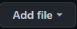
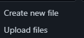
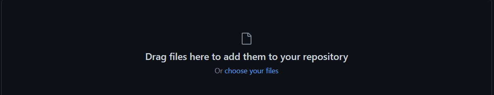
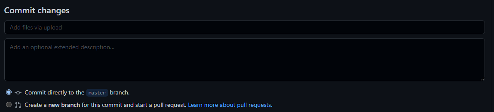
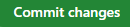

   

# MS-DOS v1.25 and v2.0 Source Code
Code for MS-DOS Aplication for "ReturnOS" 
This is a Modified Version of MS-DOS with the Template of 1.25 for "First Edition" (FE) and 2.0 for "Second Edition"
> NOTE: We Recommend use Seccond Edition (SE) for More Compatibility With Programs
**Third Edition** _(6.0)_ **(TE)** _Coming Really Soon!_
# About ReturnDOS
#### ReturnDOS is a Modified Version of MicroSoft Disk Operative System (MS-DOS)
ReturnDOS is a Modified Version of MS DOS Designed for Compatibility with ReturnOS 
ReturnDOS Runs DOS in Modern PC's
There You Can Found the Official ReturnDOS Source Code
NOTE: ReturnOS is not a Graphical User Interface for ReturnDOS otherwise ReturnOS have his own kernel called "System.sys" That Its Ubicated in /ReturnOSystem/KernelFiles/System.sys
> REALLY IMPORTANT NOTE: For Your SAFETY Do NOT Delete System.sys if you Delete OR Modify System.sys your Computer CAN Not Work 
ReturnDOS is An Aplication for ReturnOS 1.0 that is designed to Run DOS Applications in your ReturnOS Direcctly
ReturnDOS Currently Supports DOS 1.25 (FE) and 2.0 (SE) 
We Are Planning To Add 3.0, 4.0, 5.0 and 6.0
If You Have some of the DOS Versions Mentioned Before then Upload It To Help This Project!
How To Upload
1. Click "Add File" in Main Page of the Repostory

2. In The Mini Menu Click "Upload Files"
 
 3. Drag N Drop Files OR Choose your DOS Files
 
 4. Commit and Pull your Files To The Repostory
 
 5.To End,Click "Commit Changes"
 
 NOTE: To Make Sure That is DOS Create a Folder with the Version (ex 1.25 or 2.0)
